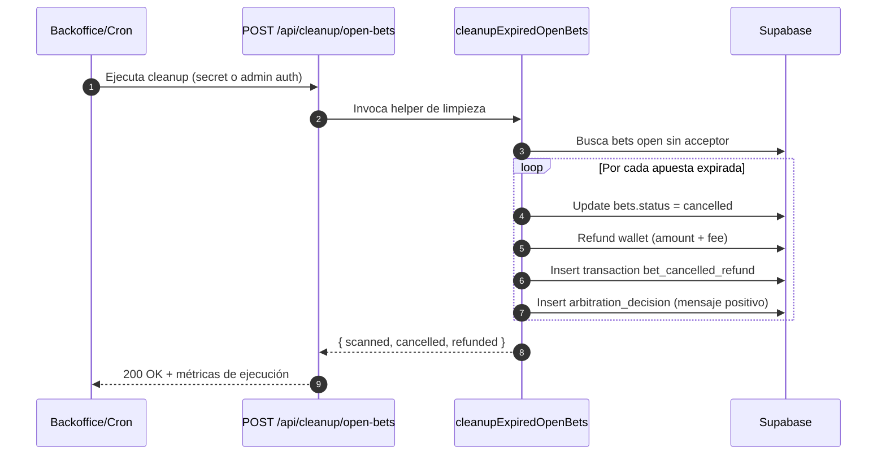
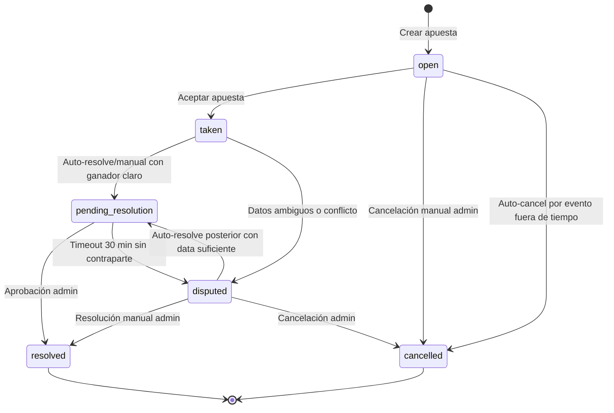
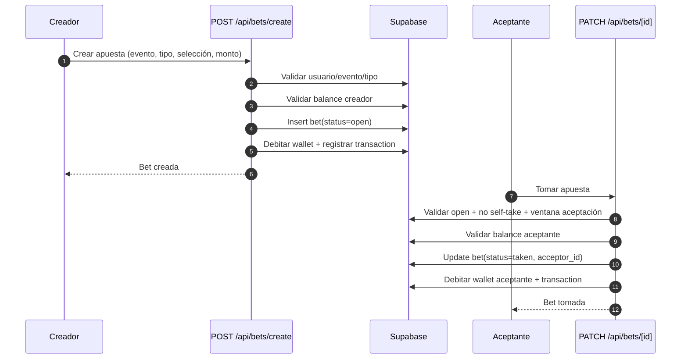
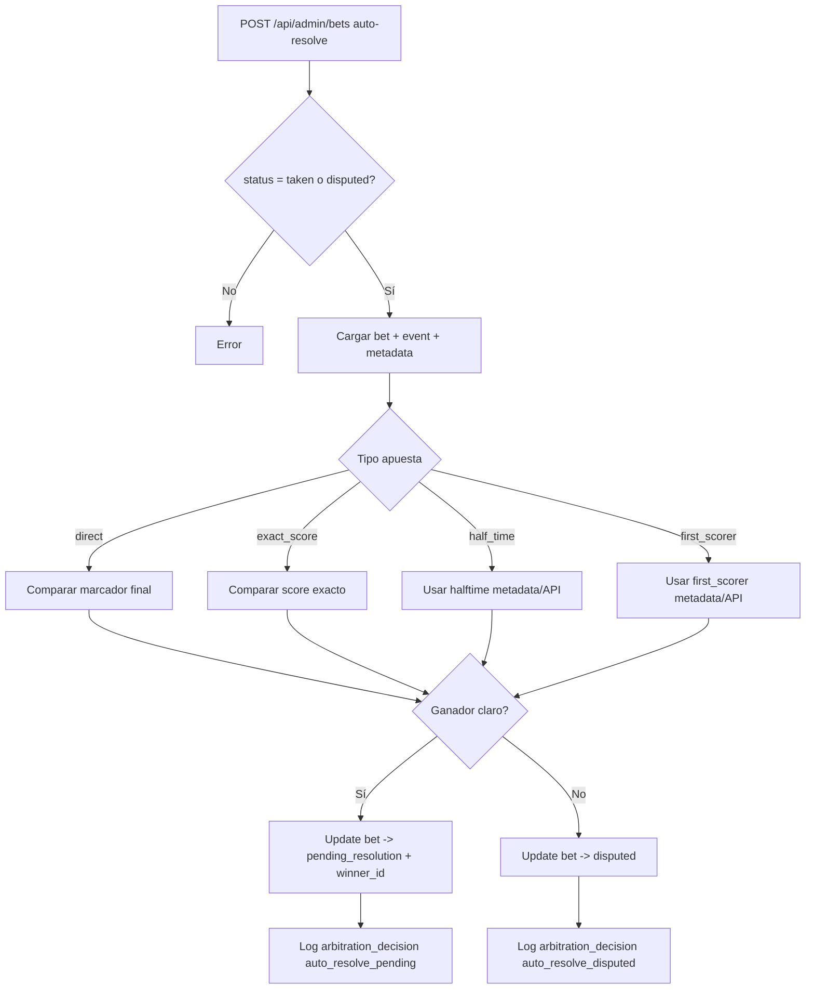
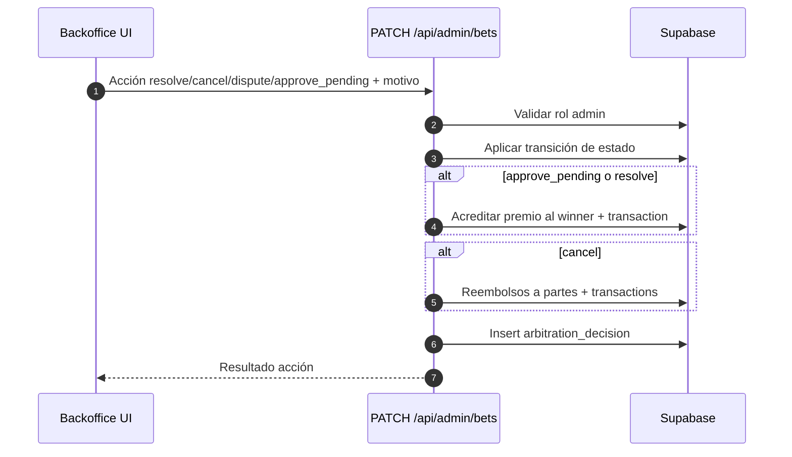
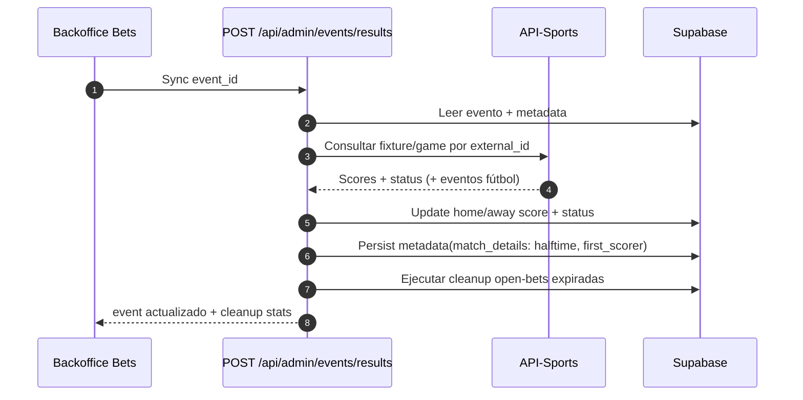
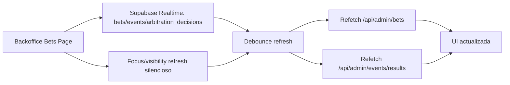

# iBetYou - Documentación Completa

**Última actualización**: 3 de Abril de 2026 (rev. 5)  
**Estado**: ✅ Core APIs implementadas - ✅ Backoffice separado - ✅ Módulo de usuarios - ✅ Auditoría lógica de negocio - ✅ Rebranding iBetYou - ✅ Hardening de arbitraje y moderación

---

## Tabla de Contenidos

1. [Visión General](#visión-general)
2. [Arquitectura del Sistema](#arquitectura-del-sistema)
3. [APIs Implementadas](#apis-implementadas)
4. [Sistema de Roles y Backoffice](#sistema-de-roles-y-backoffice)
5. [Módulo de Administración de Usuarios](#módulo-de-administración-de-usuarios)
6. [Reglas del Sistema de Apuestas](#reglas-del-sistema-de-apuestas)
7. [Migraciones Realizadas](#migraciones-realizadas)
8. [Seguridad](#seguridad)
9. [Estructura de Código](#estructura-de-código)
10. [Ejemplos de Uso](#ejemplos-de-uso)
11. [Checklist de Estado](#checklist-de-estado)
12. [Cambios Recientes (2026-04-03)](#cambios-recientes-2026-04-03)

---

## Visión General

### ¿Qué es iBetYou?

iBetYou es una plataforma de apuestas deportivas **fantasy** peer-to-peer donde los usuarios pueden:
- **Crear apuestas**: Proponer un resultado y esperar a que otro usuario la acepte
- **Tomar apuestas**: Aceptar la propuesta de otro usuario y competir
- **Clonar apuestas**: Reutilizar configuraciones de apuestas existentes
- **Recibir bonus**: Ganancias por login diarios (hasta $500/día, $1000 acumulado)

### Stack Tecnológico

- **Frontend**: Next.js 16.2.1 + React 19 + TypeScript
- **Backend**: Next.js API Routes
- **Base de Datos**: Supabase PostgreSQL
- **Autenticación**: Supabase Auth
- **UI**: Tailwind CSS 4 + Radix UI
- **Estado**: React Hooks

### Mejoras Realizadas - Migración a API

Se ha completado una **migración completa de seguridad** moviendo toda la lógica de negocio desde el cliente hacia el servidor:

✅ **Antes**: Operaciones de base de datos directas desde el navegador (inseguro)  
✅ **Después**: Todas las operaciones via APIs seguras en el servidor

**Impacto de seguridad**:
- 🔐 Eliminadas vulnerabilidades de manipulación de datos
- 🔐 Validaciones centralizadas en servidor
- 🔐 Imposible burlar límites de bonificación
- 🔐 Transacciones atómicas garantizadas

---

## Arquitectura del Sistema

### Flujo de Datos

```
┌─────────────────┐
│  React Pages    │  (UI sin lógica de negocio sensible)
└────────┬────────┘
         │
         │ HTTP/REST
         ↓
┌─────────────────────────────┐
│  Next.js API Routes         │  (Validaciones críticas)
│  - /api/auth/*              │
│  - /api/bets/*              │
│  - /api/user/*              │
└────────┬────────────────────┘
         │
         │ Queries Seguras
         ↓
┌─────────────────────────────┐
│  Supabase (PostgreSQL)      │
│  - RLS Policies             │
│  - Transacciones DB         │
│  - Auditoría                │
└─────────────────────────────┘
```

### Tablas Principales

```
┌──────────────┐
│  profiles    │  - userId, nickname, avatar_url, kyc_status
├──────────────┤
│  wallets     │  - user_id, balance_fantasy, balance_real, fantasy_total_accumulated
├──────────────┤
│  transactions│  - user_id, token_type, amount, operation, reference_id
├──────────────┤
│  events      │  - id, sport, home_team, away_team, start_time, home_score, away_score
├──────────────┤
│  bets        │  - id, event_id, creator_id, acceptor_id, amount, multiplier, status
├──────────────┤
│  daily_rewards│ - user_id, reward_amount, rewarded_at
└──────────────┘
```

---

## APIs Implementadas

---

## Cambios Recientes (2026-04-03)

1. Se unificó el estado canónico `pending_resolution` y se mantuvo compatibilidad con estados legacy en consultas/UI.
2. Se enriqueció la tarjeta de moderación en backoffice con tipo de apuesta, marcador final y badge de lista para moderación.
3. Se corrigió la determinación de ganador en aprobaciones pendientes cuando hay discrepancias entre status legacy, `winner_id` y claims.
4. Se fortaleció la sincronización de eventos con apuestas desde backoffice (consulta independiente).
5. Se implementó timeout de eventos estancados: si siguen `scheduled/live` por 4h desde inicio, pasan a `finished`.
6. Se endureció auth de API con mejor extracción de sesión/token desde cookies y formatos alternativos.
7. Se añadieron actualizaciones en vivo (realtime/foco/visibilidad) en vistas críticas para reducir recargas manuales.
8. Se ajustó la lógica de botones de participante para evitar acciones inválidas cuando ya hay reclamo del rival.
9. Se mejoró la mensajería UX para estados finales (`resolved/cancelled/disputed`) evitando estados crudos.
10. Se eliminaron prompts del navegador en backoffice bets y se reemplazaron por modales internos con motivo.
11. Se agregó escalado automático de `pending_resolution*` a `disputed` tras 30 minutos sin respuesta de contraparte.
12. Se habilitó auto-resolver en apuestas `disputed` además de `taken`.
13. Se implementó auto-resolver específico para `half_time` usando marcador HT en metadata o API externa.
14. Se implementó auto-resolver específico para `first_scorer` usando metadata y fallback a eventos de fixture.
15. Se persisten datos extendidos de evento en metadata: marcador de medio tiempo y primer anotador (cuando disponible).
16. Se restringieron `half_time` y `first_scorer` a fútbol (UI + backend), bloqueados para otros deportes.
17. Se corrigió el listado de eventos en crear apuesta para incluir `scheduled/live` en ventana reciente, mejorando béisbol.
18. En backoffice events, se dejó vista inicial en `Eventos Guardados` y jerarquía: hoy, próximos y pasados desplegables.
19. Se limitó la sección de eventos pasados a 7 días para reducir ruido operativo.
20. Se mejoró UX del calendario en filtros (`Desde/Hasta`) con botones explícitos para abrir picker.
21. Se movió la limpieza de apuestas `open` expiradas a un endpoint dedicado `POST /api/cleanup/open-bets` para ejecución cron/manual.
22. Se eliminó la ejecución de esa limpieza en GET de listados para reducir costo de lectura.
23. Se integró la ejecución del cleanup al flujo operativo de backoffice al actualizar/sincronizar eventos, manteniendo el control explícito por acción administrativa.

### Detalle técnico: cleanup de apuestas abiertas expiradas

#### Objetivo

Evitar ejecutar lógica de cierre automático de apuestas en cada endpoint de lectura (`GET`) para reducir costo de consulta y acoplarla a una operación explícita (cron/manual o acción de backoffice).

#### Arquitectura aplicada

1. **Helper reusable de dominio**
- Archivo: `lib/open-bets-cleanup.ts`
- Función principal: `cleanupExpiredOpenBets(supabase, decidedBy)`
- Responsabilidad:
  - Buscar apuestas `open` sin `acceptor_id`.
  - Detectar expiración por ventana de aceptación o estado del evento (`live/finished`).
  - Cambiar estado a `cancelled`.
  - Reembolsar `amount + fee_amount` al creador.
  - Insertar transacción `bet_cancelled_refund`.
  - Registrar decisión en `arbitration_decisions` con mensaje positivo.

2. **Endpoint dedicado de cleanup**
- Archivo: `app/api/cleanup/open-bets/route.ts`
- Método: `POST`
- Ruta: `/api/cleanup/open-bets`
- Ejecuta el helper y devuelve métricas de ejecución.

3. **Desacople de endpoints de lectura**
- Se removió la ejecución de cleanup en:
  - `app/api/admin/bets/route.ts` (GET)
  - `app/api/my-bets/route.ts` (GET)

4. **Disparo operativo desde backoffice**
- En `app/backoffice/bets/page.tsx`:
  - `Actualizar eventos` ejecuta refresh + cleanup dedicado.
  - `Sync` por evento también devuelve resultado de cleanup desde backend.

5. **Disparo backend durante sync de resultados**
- En `app/api/admin/events/results/route.ts` (POST):
  - Después de actualizar marcador/status de evento, ejecuta cleanup.
  - Incluye resumen `cleanup` en la respuesta.

#### Contrato del endpoint `/api/cleanup/open-bets`

**Request**
- `POST /api/cleanup/open-bets`
- Sin body obligatorio.
- Autorización:
  - O bien secret técnico (`x-cleanup-secret` o `Authorization: Bearer <secret>`),
  - O bien usuario `backoffice_admin` autenticado.

**Response (200)**
```json
{
  "success": true,
  "message": "Open bets cleanup completed",
  "scanned": 42,
  "cancelled": 7,
  "refunded": 7
}
```

#### Reglas de negocio de expiración

- Universo: apuestas con `status = open` y `acceptor_id IS NULL`.
- Una apuesta se auto-cancela si se cumple cualquiera:
  1. Ya venció la ventana de aceptación (`start_time + 10 min`).
  2. El evento está `live`.
  3. El evento está `finished`.

#### Efectos transaccionales por apuesta cancelada

1. `bets.status` → `cancelled` (solo si aún estaba `open`).
2. `wallets.balance_fantasy` del creador incrementa en `amount + fee_amount`.
3. Inserta `transactions` con `operation = bet_cancelled_refund`.
4. Inserta `arbitration_decisions` con:
  - `action = auto_cancel_open_expired`
  - `source = system`
  - `reason` positivo para motivar al creador.

#### Seguridad y acceso

- Variables soportadas para secret técnico:
  - `CLEANUP_API_SECRET`
  - fallback: `CRON_SECRET`
- Si no se envía secret válido, el endpoint exige control de rol backoffice (`requireBackofficeAdmin`).

#### Operación recomendada (cron)

Ejecutar cada 5-10 minutos:
- URL: `POST https://<dominio>/api/cleanup/open-bets`
- Header: `x-cleanup-secret: <CLEANUP_API_SECRET>`

Esto mantiene consistencia operativa sin penalizar endpoints de lectura frecuentes.

#### Diagrama de secuencia (flujo cleanup)



#### Diagramas adicionales de lógica de negocio

##### 1) Máquina de estados de apuesta



##### 2) Flujo crear y tomar apuesta



##### 3) Auto-resolve de apuestas (direct/exact_score/half_time/first_scorer)



##### 4) Moderación manual en backoffice



##### 5) Sync de eventos y preparación para moderación



##### 6) Vista backoffice en vivo (sin recarga intrusiva)



### Auditoría de lógica de negocio (backend/API)

- Las mutaciones críticas de estado, arbitraje, aprobación, disputa, auto-resolución, wallets y transacciones se ejecutan en backend/API.
- El frontend conserva cálculos de presentación y validaciones UX, pero no actúa como fuente de verdad para persistencia.

### 1️⃣ Autenticación y Bonificación

#### `POST /api/auth/login-bonus`
**Distribución automática de bonos por login**

```json
REQUEST:
{
  "userId": "uuid"
}

RESPONSE:
{
  "success": true,
  "bonus": 50,
  "message": "+$50 Fantasy Tokens acreditados! Límite diario: $450 restantes",
  "remaining": 450
}
```

**Lógica**:
- ✅ Primer login: +$50 welcome bonus (fuera del límite diario)
- ✅ Logins subsecuentes: +$50 por login (máximo $500/día)
- ✅ Límite acumulado: $1000 total
- ✅ Valida balance antes de otorgar
- ✅ Registra en tabla `daily_rewards` con timestamp

**Cambios de migración**:
- ❌ Antes: Lógica en `/app/login/page.tsx` (cliente)
- ✅ Ahora: Validación segura en servidor

---

#### `POST /api/auth/register/nickname`
**Guardar apodo elegido durante registro**

```json
REQUEST:
{
  "userId": "uuid",
  "nickname": "TheOne"
}

RESPONSE:
{
  "success": true,
  "nickname": "TheOne1"
}
```

**Lógica**:
- ✅ Intenta usar el apodo exacto
- ✅ Si está tomado, agrega números (TheOne → TheOne1 → TheOne2)
- ✅ Máximo 100 intentos de fallback
- ✅ Valida UNIQUE constraint en DB

**Cambios de migración**:
- ❌ Antes: Lógica en `/app/register/page.tsx`
- ✅ Ahora: Reintentos seguros en servidor

---

#### `GET /api/auth/callback`
**Callback de OAuth/Email confirmation - ACTUALIZADO**

Ahora incluye lógica de bonus al confirmar email.

---

### 2️⃣ Gestión de Apuestas

#### `POST /api/bets/create`
**Crear nueva apuesta con todas las validaciones**

```json
REQUEST:
{
  "userId": "uuid",
  "eventId": 12345,
  "betType": "direct",
  "selection": {
    "betType": "direct",
    "selection": "Home Team",
    "exactScoreHome": 0,
    "exactScoreAway": 0,
    "event": { ... }
  },
  "amount": 100,
  "multiplier": 1,
  "fee": 3
}

RESPONSE:
{
  "success": true,
  "bet": {
    "id": "uuid",
    "status": "open"
  }
}
```

**Validaciones Críticas**:
- ✅ Usuario existe y está autenticado
- ✅ Event ID es válido
- ✅ Balance suficiente: `balance >= amount + fee`
- ✅ Campos requeridos presentes
- ✅ Tipos de apuesta válidos (direct, exact_score, first_scorer, half_time)

**Operaciones Atómicas**:
1. Crear registro en tabla `bets`
2. Deducir monto de wallet (`amount + fee`)
3. Registrar transacción en tabla `transactions`
4. Registrar en auditoría

**Cambios de migración**:
- ❌ Antes: Todo en `components/create-bet-form.tsx` (inseguro)
- ✅ Ahora: Validaciones y transacciones en servidor

---

#### `GET /api/bets/[id]/clone`
**Obtener datos de apuesta para clonarla**

```json
RESPONSE:
{
  "success": true,
  "bet": {
    "event": { ... },
    "bet_type": "direct",
    "amount": 100,
    "multiplier": 1,
    "selection": "..."
  }
}
```

**Cambios de migración**:
- ❌ Antes: Query directo desde cliente
- ✅ Ahora: API filtra datos sensibles, devuelve solo lo necesario

---

#### `PATCH /api/bets/[id]`
**Aceptar/tomar una apuesta (ya existía, sin cambios)**

```json
REQUEST:
{
  "user_id": "uuid"
}
```

**Validaciones**:
- ✅ Usuario no es el creador
- ✅ Apuesta está en estado "open"
- ✅ Usuario tiene balance suficiente
- ✅ Usuario no tiene otra apuesta en el mismo evento

---

### 3️⃣ Información del Usuario

#### `GET /api/user/info`
**Obtener perfil actual del usuario y balance**

```json
HEADERS:
Authorization: Bearer <token>
x-api-key: <YOUR_PUBLIC_APP_API_KEY>

RESPONSE:
{
  "success": true,
  "user": {
    "id": "uuid",
    "email": "user@email.com",
    "nickname": "TheOne"
  },
  "balance": {
    "fantasy": 450,
    "real": 0
  }
}
```

**Cambios de migración**:
- ❌ Antes: 2+ queries separadas en `components/create-bet-form.tsx`
- ✅ Ahora: Single endpoint consolidado

---

#### `GET /api/user/profile`
**Obtener perfil completo con estadísticas**

```json
HEADERS:
x-user-id: uuid
x-api-key: <YOUR_PUBLIC_APP_API_KEY>

RESPONSE:
{
  "success": true,
  "profile": {
    "id": "uuid",
    "nickname": "TheOne",
    "avatar_url": "https://...",
    "kyc_status": "pending",
    "created_at": "2024-01-01T00:00:00Z"
  },
  "wallet": {
    "balance_fantasy": 450,
    "balance_real": 0,
    "fantasy_total_accumulated": 550
  },
  "stats": {
    "total_bets": 10,
    "won_bets": 7,
    "win_rate": 70,
    "current_streak": 0
  }
}
```

**Beneficios**:
- ✅ 1 query en lugar de 3+
- ✅ Stats precalculados en servidor
- ✅ Menos latencia de red

**Cambios de migración**:
- ❌ Antes: Queries separadas en `/app/profile/page.tsx`
- ✅ Ahora: Consolidado en una sola llamada

---

## Reglas del Sistema de Apuestas

### Tipos de Eventos Disponibles

Un evento debe cumplir **TODAS** estas condiciones para aparecer en el marketplace:

| Campo | Condición | Razón |
|-------|-----------|-------|
| `status` | = 'scheduled' | Solo eventos que no han iniciado |
| `start_time` | >= ahora | No se puede apostar en eventos ya empezados |
| `start_time` | <= 30 días | Limitar a próximo mes para liquidez |

**Filtros en UI**:
- 🏀 Sport selector (Fútbol, Basketball, Béisbol)
- 🔍 Búsqueda por equipo/liga
- 📅 Solo muestra apuestas 'open'

---

### Ver Apuestas (Marketplace)

#### Página Principal (`/`)

**Visible para todos**:
- ✅ Apuestas con `status = 'open'` (disponibles para tomar)
- ✅ Apuestas creadas OTROS usuarios
- ❌ No mostrar apuestas propias (aunque sean open)
- ❌ No mostrar apuestas tomadas/finalizadas en marketplace

```typescript
// Filtro aplicado
const filteredBets = bets.filter((bet) => {
  if (bet.status !== 'open') return false
  if (user && bet.creator_id === user.id) return false
  return matchesSearch && matchesSport
})
```

#### Página de Detalle (`/bet/[id]`)

**Quién puede ver cada apuesta**:

| Quién | Apuesta 'open' | Apuesta 'taken' | Apuesta 'resolved' |
|------|----------------|-----------------|-------------------|
| Creador | ✅ Siempre | ✅ Siempre | ✅ Siempre |
| Aceptante | ✅ Siempre | ✅ Siempre | ✅ Siempre |
| Otro usuario | ✅ Ver detalles | ✅ Ver detalles | ✅ Ver detalles |
| No autenticado | ✅ Ver detalles | ✅ Ver detalles | ✅ Ver detalles |

---

### Tomar/Aceptar Apuesta

#### Requisitos para aceptar

Un usuario PUEDE aceptar si cumple **TODAS** estas condiciones:

| # | Regla | Validación |
|---|-------|-----------|
| 1 | Estar autenticado | `user !== null` |
| 2 | No ser el creador | `user.id !== bet.creator_id` |
| 3 | Apuesta está 'open' | `bet.status === 'open'` |
| 4 | No tiene apuesta en el mismo evento | Query DB: `bets.find({event_id, [creator_id OR acceptor_id] === user.id, status === 'taken'})` |
| 5 | Tiene balance suficiente | `wallet.balance_fantasy >= totalNeeded` |

**Código de validación**:
```typescript
// Validar no es creador
if (user.id === bet.creator_id) {
  error = "No puedes aceptar tu propia apuesta"
}

// Validar no tiene otra apuesta en el evento
const existingBet = await supabase
  .from("bets")
  .select("id")
  .eq("event_id", bet.event_id)
  .eq("status", "taken")
  .or(`creator_id.eq.${user.id},acceptor_id.eq.${user.id}`)
  .maybeSingle()

if (existingBet) {
  error = "Ya tienes una apuesta en este partido"
}
```

**Cálculo de monto necesario**:
```typescript
// Para apuestas simétricas: el aceptante cubre el mismo monto base
const totalNeeded = bet.amount

// Para apuestas asimétricas: el aceptante cubre monto * multiplicador
const totalNeeded = bet.amount * bet.multiplier
```

---

### Clonar Apuesta

#### Quién puede clonar

| Condición | Puede clonar? |
|-----------|----------------|
| Es creador | ✅ Sí |
| Ya la tomó (aceptante) | ✅ Sí |
| Otro usuario, apuesta 'open' | ✅ Sí |
| Otro usuario, apuesta 'taken' | ✅ Sí |
| No autenticado | ❌ No |

#### Flujo de clonación

1. Usuario ve apuesta que le interesa
2. Hace click en "Clonar esta apuesta"
3. Se abre modal de crear apuesta con datos pre-cargados:
   - Sport seleccionado
   - Evento seleccionado
   - Tipo de apuesta (direct, exact_score, etc)
   - Monto
   - Multiplicador
   - Selección (home/away/resultado exacto)
4. Usuario puede modificar valores
5. Al crear, se usa API `POST /api/bets/create` normal

---

### Estados de una Apuesta

**Ciclo de vida completo**:

```
open
  ↓
  ├─→ taken (usuario la acepta)
  │     ↓
  │     ├─→ pending_resolution_creator (admin resuelve, creador ganó)
  │     │     ↓
  │     │     └─→ resolved (admin aprueba, dinero transferido)
  │     │
  │     ├─→ pending_resolution_acceptor (admin resuelve, aceptante ganó)
  │     │     ↓
  │     │     └─→ resolved (admin aprueba, dinero transferido)
  │     │
  │     ├─→ cancelled (admin cancela)
  │     │
  │     └─→ disputed (con disputa)
  │
  └─→ cancelled (admin cancela antes de tomar)
```

| Estado | Descripción | Puede ser tomada? | Visible? |
|--------|-------------|-------------------|----------|
| `open` | Disponible para tomar | ✅ | ✅ Todos |
| `taken` | Ya fue tomada | ❌ | ✅ Todos |
| `pending_resolution_*` | Esperando aprobación admin | ❌ | ✅ Todos |
| `resolved` | Completada, dinero transferido | ❌ | ✅ Todos |
| `cancelled` | Cancelada por admin | ❌ | ❌ Solo partes |
| `disputed` | En disputa | ❌ | ✅ Todos |

---

### Límite de Monto al Crear Apuesta

El campo de monto en el formulario de creación está limitado dinámicamente según el balance disponible del usuario:

```
maxAmountByBalance = floor((balance_fantasy / 1.03) × 100) / 100
```

- Se divide entre `1.03` para contemplar que el monto deducido incluye el fee del 3%
- **No hay tope fijo**: el máximo es el total del balance disponible (antes había un tope de $100 que fue eliminado)
- El `<input>` tiene `max` y `onChange` que impiden ingresar un valor mayor al permitido
- Se muestra texto de ayuda: _"Máximo disponible según tu balance: $X"_

---

### Tipos de Apuestas: Simétrico vs Asimétrico

#### Apuestas Simétricas
**Aplican a**: Directa (ganador/perdedor) y Medio Tiempo

**Características**:
- Multiplicador siempre = 1 (no se muestra)
- Creador paga: `amount + fee`
- Aceptante paga: `amount + (amount * 0.03)`
- Ambos tienen misma ganancia bruta potencial: `+amount`

**Ejemplo**:
```
Creador: apuesta "Gana Home" por $10 (fee $0.30)
Aceptante: apuesta "Gana Away" por $10 (fee $0.30)
Resultado: Gana Home
  → Creador cobra $20 (ganancia neta +$10)
Resultado: No gana Home
  → Aceptante cobra $20 (ganancia neta +$9.70)
```

#### Apuestas Asimétricas
**Aplican a**: Resultado Exacto

**Características**:
- Multiplicador puede ser > 1 (aplica solo al creador)
- Creador paga: `amount + fee`
- Aceptante paga: `amount × multiplier`
- Ganancia neta del creador si acierta: `amount × multiplier`
- Ganancia neta del aceptante si acierta: `amount`

**Ejemplo**:
```
Creador: apuesta "Resultado exacto 3-0" por $10 con multiplicador 5 (fee $0.30)
Aceptante: apuesta "Cualquier otro resultado" cubriendo $50
Resultado: 3-0
  → Creador cobra $60 (ganancia neta +$50)
Resultado: NO sale 3-0
  → Aceptante cobra $60 (ganancia neta +$10)
```

---

### Resolución y Aprobación de Apuestas

#### Auto-Resolución (Admin)

El panel de administración (`/backoffice/bets`) permite que un admin use "🤖 Auto-resolver":

1. **Consulta API externa**: Obtiene marcador actual del evento
2. **Compara selecciones según tipo de apuesta**:
  - `direct`: evalúa ganador del partido
  - `exact_score`: evalúa marcador exacto del creador
  - `half_time`, `first_scorer` y otros no soportados por auto-resolución: pasan a `disputed` para arbitraje manual
3. **Resultado de auto-resolución**:
  - Si creador acertó → `pending_resolution_creator`
  - Si aceptante acertó → `pending_resolution_acceptor`
  - Si no se puede decidir con certeza → `disputed`
  - Si empate en `direct` (no béisbol) → resuelve empate con devolución
3. **Actualiza evento**: Guarda `home_score` y `away_score`
4. **Pasa a aprobación**: Estado cambió a `pending_resolution_*`

#### Flujo de Arbitraje/Disputa (Completo)

1. **Disparo de disputa**:
  - Manual por admin (`action = dispute`), con motivo requerido
  - Automático cuando la auto-resolución no puede decidir con reglas seguras
2. **Estado operativo**:
  - La apuesta pasa a `disputed`
  - Queda bloqueada para resolución automática
3. **Decisión arbitral**:
  - Admin resuelve manualmente con ganador y motivo
  - O cancela con motivo y devolución a involucrados
4. **Trazabilidad obligatoria**:
  - Cada acción arbitral se guarda en `arbitration_decisions`
  - Incluye: acción, estado previo/nuevo, ganador decidido, motivo, fuente (`manual`/`auto`) y fecha

#### Cancelación por Admin (con Devolución)

Cuando un admin cancela una apuesta desde `/backoffice/bets`, el sistema devuelve automáticamente el dinero a los involucrados antes de marcarla como `cancelled`.

**Quién recibe devolución**:

| Parte | Condición | Monto devuelto |
|-------|-----------|----------------|
| Creador | Siempre | `amount + fee_amount` |
| Aceptante | Solo si la apuesta estaba `taken` | `(amount + 3%)` (simétrica) o `(amount × multiplier) + 3%` (asimétrica) |

**Validaciones**:
- Si la apuesta ya está `cancelled` o `resolved`, retorna `400` (no se procesa dos veces)
- Cada devolución genera una transacción con `operation = 'bet_cancelled_refund'` en la tabla `transactions`

**Código relevante**: `app/api/admin/bets/route.ts` → case `'cancel'`

---

#### Aprobación y Transferencia

Para transferir dinero, admin debe aprobar:

**Cálculos**:
```
Premio total = amount × multiplier + amount
Comisión ya cobrada = fee_amount
Devolución al perdedor = 0
```

**Acciones**:
1. Actualizar wallet del ganador: `+= prize_total`
2. Crear transacción: `operation = 'bet_won'`
3. Actualizar apuesta: `status = 'resolved'`, `resolved_at = NOW()`
4. No se devuelve monto al perdedor en resolución estándar

**Aprobación masiva**: Seleccionar varias apuestas pendientes y aprobar en lote.

#### Historial de Decisiones Arbitrales (Backoffice)

Se implementó historial por apuesta en el panel `/backoffice/bets`:

- Se muestra resumen de la última decisión y opción de expandir historial completo
- Cada entrada incluye:
  - `action` (ej. `approve_pending`, `cancel`, `dispute`, `auto_resolve_pending`)
  - `source` (`manual`, `auto`, `system`)
  - estados (`previous_status` → `new_status`)
  - `reason` (motivo)
  - `decided_by`
  - timestamp

Tabla persistente en DB:
- `arbitration_decisions` (relacionada por `bet_id`)

---

## Migraciones Realizadas

### Cambios Principales

#### 1. Componente: `components/create-bet-form.tsx`

**Antes (❌ Inseguro)**:
```typescript
// TODO directamente en el cliente
const { data: bet } = await supabase.from("bets").insert({...})
await supabase.from("wallets").update({...})
await supabase.from("transactions").insert({...})
```

**Problemas**:
- Cliente puede manipular IDs
- No hay validación de balance real
- Race conditions posibles
- Múltiples queries, no atómicas

**Después (✅ Seguro)**:
```typescript
const res = await fetch("/api/bets/create", {
  method: "POST",
  body: JSON.stringify({userId, eventId, amount, ...})
})
```

**Beneficios**:
- Validación en servidor
- Balance verificado antes de procesar
- Transacción atómica
- Imposible burlar validaciones

**Cambios específicos**:
- Removida: `createBrowserSupabaseClient` para DB ops
- Removido: `supabase.from("bets").insert()`
- Removido: `supabase.from("wallets").update()`
- Removido: `supabase.from("transactions").insert()`
- Agregado: Llamada a `POST /api/bets/create`
- Agregado: Llamada a `GET /api/bets/[id]/clone` para clonar
- Agregado: Llamada a `GET /api/user/info` para balance

---

#### 2. Página: `app/login/page.tsx`

**Antes (❌ Inseguro)**:
```typescript
// Bonus logic en cliente
const todayTotal = (todayBonuses || []).reduce((sum, b) => sum + b.reward_amount, 0)
if (remainingDaily > 0 && remainingGlobal > 0) {
  await supabase.from("wallets").update({...})
  await supabase.from("transactions").insert({...})
  await supabase.from("daily_rewards").insert({...})
}
```

**Después (✅ Seguro)**:
```typescript
const res = await fetch("/api/auth/login-bonus", {
  method: "POST",
  body: JSON.stringify({userId: data.user.id})
})
```

**Cambios**:
- Removida: Toda lógica de cálculo de bonus
- Removida: Todas las updates a lwallets
- Agregado: Llamada a `POST /api/auth/login-bonus`

---

#### 3. Página: `app/register/page.tsx`

**Antes (❌ Inseguro)**:
```typescript
// Update directo a perfil desde cliente
const { error } = await supabase
  .from("profiles")
  .update({ nickname: finalNickname })
  .eq("id", data.user.id)
```

**Después (✅ Seguro)**:
```typescript
const res = await fetch("/api/auth/register/nickname", {
  method: "POST",
  body: JSON.stringify({userId, nickname})
})
```

**Cambios**:
- Removida: Update directo a DB
- Removida: Lógica de reintentos
- Agregado: Llamada a `POST /api/auth/register/nickname`
- Agregado: Manejo de errores de API

---

#### 4. Página: `app/profile/page.tsx`

**Antes (❌ Ineficiente)**:
```typescript
// 3+ queries separadas en el cliente
const profileData = await supabase.from("profiles").select("*")...
const wallet = await supabase.from("wallets").select("*")...
const bets = await supabase.from("bets").select("*")...

// Stats calculados en cliente
const stats = {
  total_bets: bets.length,
  won_bets: bets.filter(b => b.status === 'resolved').length
}
```

**Después (✅ Eficiente)**:
```typescript
const res = await fetch("/api/user/profile", {
  headers: {"x-user-id": userId}
})
// Retorna: profile, wallet, stats - TODO en un solo call
```

**Cambios**:
- Removída: Múltiples queries
- Removida: Lógica de cálculo de stats en cliente
- Agregado: Llamada única a `GET /api/user/profile`

---

### Resumen de Cambios por Componente

| Archivo | Cambios | Líneas removidas | APIs agregadas |
|---------|---------|------------------|-----------------|
| `create-bet-form.tsx` | 5 operaciones DB → 1 API | ~50 | 3 |
| `login/page.tsx` | Bonus logic → API | ~75 | 1 |
| `register/page.tsx` | Nickname update → API | ~30 | 1 |
| `profile/page.tsx` | 3+ queries → 1 API | ~45 | 1 |

**Total**: ~200 líneas de código inseguro removidas, consolidadas en 6 APIs robustas

---

## Seguridad

### Validaciones en Servidor

✅ **Balance suficiente** - Validado antes de cada operación  
✅ **Tokens verificados** - JWT validation en cada request  
✅ **Transacciones atómicas** - Operaciones de DB garantizadas ACID  
✅ **Sin confianza en cliente** - Todos los datos revalidados en servidor  
✅ **Rate limiting** - Próximo a implementar  
✅ **Auditoría de operaciones** - Todas registradas  

### Headers de Autenticación

```
Públicas (sin auth):
  GET /api/events/list
  GET /api/bets (solo 'open')

Protegidas (requieren x-api-key):
  POST /api/bets/create
  POST /api/auth/login-bonus
  GET /api/bets/[id]/clone

Autenticadas (requieren Bearer token):
  GET /api/user/info
  GET /api/user/profile
```

**Headers obligatorios**:
```
x-api-key: <YOUR_PUBLIC_APP_API_KEY>  // Secret key
Authorization: Bearer <token>  // Para endpoints autenticados
x-user-id: uuid  // ID del usuario (donde aplica)
```

### RLS (Row Level Security)

Todas las tablas tienen políticas RLS que garantizan:
- ✅ Usuarios solo ven personas sus propios datos
- ✅ Admin puede ver/modificar todo (service role)
- ✅ Apuestas 'open' visibles para todos
- ✅ Apuestas privadas solo para partes involucradas

---

## Estructura de Código

### Directorios Nuevos

```
app/api/
├── auth/
│   ├── login-bonus/route.ts              ← POST /api/auth/login-bonus
│   ├── register/nickname/route.ts        ← POST /api/auth/register/nickname
│   └── callback/route.ts                 ← GET (actualizado)
├── bets/
│   ├── create/route.ts                   ← POST /api/bets/create
│   ├── [id]/clone/route.ts               ← GET /api/bets/[id]/clone
│   └── [id]/route.ts                     ← PATCH (existía)
└── user/
    ├── info/route.ts                     ← GET /api/user/info
    └── profile/route.ts                  ← GET /api/user/profile
```

### Patrón de Endpoints

Todos los endpoints siguen este patrón:

```typescript
import { createAdminSupabaseClient } from "@/lib/supabase"
import { NextRequest, NextResponse } from "next/server"

export async function POST(request: NextRequest) {
  try {
    // 1. Validar entrada
    const { param1, param2 } = await request.json()
    if (!param1) {
      return NextResponse.json({ error: "Missing param1" }, { status: 400 })
    }

    // 2. Obtener cliente admin
    const supabase = createAdminSupabaseClient()

    // 3. Validar permisos/datos
    const { data: user } = await supabase
      .from("profiles")
      .select("id")
      .eq("id", userId)
      .single()

    if (!user) {
      return NextResponse.json({ error: "User not found" }, { status: 404 })
    }

    // 4. Ejecutar operación
    const { data, error } = await supabase
      .from("table")
      .insert(...)

    if (error) {
      return NextResponse.json({ error: error.message }, { status: 400 })
    }

    // 5. Retornar resultado
    return NextResponse.json({ success: true, data })
  } catch (error) {
    console.error("Error:", error)
    return NextResponse.json({ error: "Internal error" }, { status: 500 })
  }
}
```

---

## Ejemplos de Uso

### Crear Apuesta

```typescript
// Frontend
const response = await fetch("/api/bets/create", {
  method: "POST",
  headers: {
    "Content-Type": "application/json",
    "x-api-key": "<YOUR_PUBLIC_APP_API_KEY>"
  },
  body: JSON.stringify({
    userId: user.id,
    eventId: 12345,
    betType: "direct",
    selection: {
      selection: "Home Team",
      betType: "direct"
    },
    amount: 100,
    multiplier: 1,
    fee: 3
  })
})

if (response.ok) {
  const { bet } = await response.json()
  showToast("Apuesta creada! ID: " + bet.id)
  router.push("/my-bets")
} else {
  const { error } = await response.json()
  showToast(error, "error")
}
```

### Procesar Bonus de Login

```typescript
// Frontend
const response = await fetch("/api/auth/login-bonus", {
  method: "POST",
  headers: {
    "Content-Type": "application/json",
    "x-api-key": "<YOUR_PUBLIC_APP_API_KEY>"
  },
  body: JSON.stringify({ userId: user.id })
})

const { bonus, message, success } = await response.json()

if (success) {
  showToast(`+$${bonus} ${message}`, "success")
}
```

### Obtener Perfil Completo

```typescript
// Frontend
const { session } = await supabase.auth.getSession()
const token = session?.access_token

const response = await fetch("/api/user/profile", {
  headers: {
    "x-user-id": userId,
    "x-api-key": "<YOUR_PUBLIC_APP_API_KEY>",
    "Authorization": `Bearer ${token}`
  }
})

const { profile, wallet, stats } = await response.json()

// Usar datos
console.log(`${profile.nickname} tiene ${wallet.balance_fantasy} en balance`)
console.log(`Win rate: ${stats.win_rate}%`)
```

---

## Checklist de Estado

### ✅ Completado

- [x] POST /api/auth/login-bonus - Login bonus distribution
- [x] POST /api/auth/register/nickname - Save nickname on signup
- [x] POST /api/bets/create - Criar nova apuesta
- [x] GET /api/bets/[id]/clone - Get bet para clonar
- [x] GET /api/user/info - User profile + balance
- [x] GET /api/user/profile - Full profile + stats
- [x] components/create-bet-form.tsx - Migrated to API
- [x] app/login/page.tsx - Migrated to API
- [x] app/register/page.tsx - Migrated to API
- [x] app/profile/page.tsx - Migrated to API
- [x] Documentación centralizada
- [x] Monto máximo de apuesta basado en balance real (sin tope fijo de $100)
- [x] Devolución automática al cancelar apuesta desde backoffice

### 📋 Pendiente de Verificación/Completar

- [ ] Backoffice wallets page - Verificar APIs correctas
- [ ] Backoffice bets page - Verificar APIs correctas
- [ ] My-bets hook - Verificar que solo lee
- [ ] Navbar wallet balance - Migrar a API
- [ ] Home page (/) - Verificar queries
- [ ] Bet detail page - Verificar queries
- [ ] Testing E2E completo
- [ ] Rate limiting endpoints
- [ ] Audit logging
- [ ] Change security API key to production value

### 🚀 Próximas Mejoras

1. **Performance**
   - Agregar caching de eventos
   - Caching de estados de apuestas
   - Pagination en listados

2. **Seguridad**
   - Habilitar rate limiting
   - Implementar CORS correctamente
   - Agregar logging de auditoría
   - HTTPS enforcement
   - CSP headers

3. **Escalabilidad**
   - Database indexing review
   - Query optimization
   - Connection pooling setup

4. **Testing**
   - Unit tests para APIs
   - Integration tests
   - E2E testing
   - Load testing

---

## Integración de Cambios

### Cambios de Código por Categoría

#### 🔐 Seguridad
- Removidas todas las operaciones de DB directo desde cliente
- Movidas validaciones críticas al servidor
- Centralizadas todas las transacciones de wallet

#### ⚡ Performance
- Reducidas llamadas de red (queries consolidadas)
- Stats precalculados en servidor
- Menos carga en cliente

#### 🛠️ Mantenibilidad
- Lógica centralizada en APIs
- Componentes más simples y legibles
- Más fácil de testear y debuggear

#### 📊 Observabilidad
- Todas las APIs registran errores
- Transacciones auditables
- Mejor trazabilidad de operaciones

---

## Notas Importantes

⚠️ **API Key**: Cambiar `<YOUR_PUBLIC_APP_API_KEY>` a un valor real en producción  
⚠️ **CORS**: Verificar configuración CORS si frontend en diferente dominio  
⚠️ **Tokens**: Sincronizar expiration policy con setup actual  
⚠️ **Auditoría**: Todas las operaciones deberían logearse  
⚠️ **Testing**: Completar testing de todos los flujos antes de producción

---

## Sistema de Roles y Backoffice

### Separación App / Backoffice

El sistema maneja dos tipos de usuario completamente separados en flujos de login y permisos:

| Atributo | App User | Backoffice Admin |
|----------|----------|-----------------|
| Login URL | `/login` | `/backoffice/login` |
| Rol en DB | `app_user` | `backoffice_admin` |
| Puede crear apuestas | ✅ | ❌ 403 |
| Puede tomar apuestas | ✅ | ❌ 403 |
| Puede clonar apuestas | ✅ | ❌ 403 |
| Puede acceder a `/backoffice/*` | ❌ | ✅ |

### Columna `role` en profiles

```sql
ALTER TABLE profiles 
ADD COLUMN IF NOT EXISTS role VARCHAR(30) DEFAULT 'app_user' 
CHECK (role IN ('app_user', 'backoffice_admin'));
```

El trigger de creación de perfil ahora incluye `role` explícitamente con valor `'app_user'`.

### Flujo de autenticación Backoffice

1. Usuario navega a `/backoffice/*`
2. `BackofficeLayout` verifica sesión via `supabase.auth.getUser()`
3. Si no hay sesión → redirige a `/backoffice/login`
4. Si hay sesión pero `role !== 'backoffice_admin'` → cierra sesión + redirige a `/backoffice/login`
5. `/backoffice/login` verifica el rol vía `GET /api/user/info` tras el login
6. Si no es admin → `supabase.auth.signOut()` + mensaje de error

### Bloqueo de operaciones para backoffice_admin

Los siguientes endpoints bloquean a usuarios con `role === 'backoffice_admin'`:

| Endpoint | Respuesta |
|----------|-----------|
| `POST /api/bets/create` | `403 Los usuarios de backoffice no pueden crear apuestas` |
| `PATCH /api/bets/[id]` (tomar) | `403 Los usuarios de backoffice no pueden aceptar apuestas` |
| `GET /api/bets/[id]/clone` | `403 Los usuarios de backoffice no pueden clonar apuestas` |

---

## Módulo de Administración de Usuarios

### Página: `/backoffice/users`

Tabla completa de usuarios con:
- **Stats** en chips: total app / backoffice / baneados / bloqueados temporalmente
- **Búsqueda** por nickname o ID
- **Filtro** de rol: Todos / App / Backoffice
- **Estado** visual por fila: Activo / Baneado / Bloq. temp. / `X amon.`
- **Acciones por tipo de usuario**:
  - `app_user`: Banear (con confirmación) / Desbanear
  - `backoffice_admin`: Eliminar (con confirmación)
- **Modal "Nuevo admin"**: crea cuenta nueva con email + contraseña + nickname opcional

### API: `GET /api/admin/users`

**Parámetros opcionales**: `?role=app_user|backoffice_admin`, `?limit=N`

**Lógica adicional**: Detecta perfiles con `betting_blocked_until` ya expirado que aún tienen `false_claim_count > 0` y los resetea automáticamente en el mismo request (batch update).

**Respuesta**:
```json
{
  "users": [
    {
      "id": "uuid",
      "nickname": "TheOne",
      "role": "app_user",
      "is_banned": false,
      "betting_blocked_until": null,
      "false_claim_count": 0,
      "created_at": "2026-04-01T..."
    }
  ]
}
```

### API: `PATCH /api/admin/users`

Acciones disponibles:

| `action` | Descripción | Campos requeridos |
|----------|-------------|-------------------|
| `ban` | Banea un usuario app | `user_id` |
| `unban` | Desbanea un usuario app | `user_id` |
| `create_admin` | Crea nueva cuenta backoffice en Auth + asigna rol | `email`, `password`, `nickname?` |
| `delete` | Elimina cuenta backoffice (solo si `role === backoffice_admin`) | `user_id` |
| `set_role` | Cambia rol (aún disponible en API, deshabilitado en UI) | `user_id`, `role` |
| `promote_by_email` | Busca usuario por email y lo promueve (legacy) | `email`, `nickname?` |

**Seguridad en `delete`**: Verifica que el perfil sea `backoffice_admin` antes de llamar `supabase.auth.admin.deleteUser()`. Un `app_user` no puede ser eliminado por esta vía.

---

## Cambios en Base de Datos

### Columnas agregadas a `profiles`

```sql
-- Rol del usuario en el sistema
ALTER TABLE profiles 
ADD COLUMN IF NOT EXISTS role VARCHAR(30) DEFAULT 'app_user' 
CHECK (role IN ('app_user', 'backoffice_admin'));

-- Ban permanente por acción de admin
ALTER TABLE profiles 
ADD COLUMN IF NOT EXISTS is_banned BOOLEAN DEFAULT false;

-- Bloqueo temporal de apuestas por amonestaciones
ALTER TABLE profiles 
ADD COLUMN IF NOT EXISTS betting_blocked_until TIMESTAMPTZ;

-- Contador de reportes de resultado falsos
ALTER TABLE profiles 
ADD COLUMN IF NOT EXISTS false_claim_count INTEGER DEFAULT 0;
```

### Trigger de creación de perfil

El trigger `on_auth_user_created` fue corregido para incluir la columna `role` explícitamente:

```sql
INSERT INTO public.profiles (id, nickname, role)
VALUES (new.id, split_part(new.email, '@', 1), 'app_user');
```

---

## Sistema de Amonestaciones y Bloqueo de Apuestas

### Lógica de penalización por reporte falso

Cuando un admin resuelve una apuesta (`/api/admin/bets`, action `resolve`) y el ganador declarado **difiere** del ganador que reclamó algún participante, se aplica la función `applyFalseClaimPenalty`:

| `false_claim_count` resultante | Consecuencia |
|-------------------------------|--------------|
| 1 | Solo advertencia registrada |
| ≥ 2 | Bloqueado 10 días para apostar (`betting_blocked_until = NOW() + 10d`) |

### Limpieza automática

Cuando expira `betting_blocked_until`, al siguiente llamado a `GET /api/admin/users` el sistema detecta automáticamente los perfiles expirados con `false_claim_count > 0` y los resetea a `0` / `null` sin intervención manual.

### Bloqueo en creación de apuestas

`POST /api/bets/create` verifica:
```typescript
if (profile.betting_blocked_until && new Date(profile.betting_blocked_until) > new Date()) {
  return 403 "Tu cuenta tiene una sanción activa hasta [fecha]..."
}
```

Igual en `PATCH /api/bets/[id]` (tomar) y `GET /api/bets/[id]/clone` (clonar).

---

## Resolución por Participantes (Peer Resolution)

### Tipos que la soportan

Todos los tipos de apuesta soportan resolución entre participantes. La configuración centralizada está en `lib/bet-resolution.ts`:

```typescript
// lib/bet-resolution.ts
const PEER_RESOLUTION_BY_TYPE: Record<string, boolean> = {
  direct: true,
  exact_score: true,
  first_scorer: true,
  half_time: true,
}

export function supportsPeerResolution(betType: string | null | undefined) {
  if (!betType) return false
  return PEER_RESOLUTION_BY_TYPE[betType] === true
}
```

Para deshabilitar un tipo, basta con cambiar su valor a `false` en ese archivo — el cambio aplica tanto en UI (`app/bet/[id]/page.tsx`) como en la API (`app/api/bets/[id]/resolve/route.ts`) sin modificar nada más.

### Restricción de tiempo

Los botones "Gané" / "Perdí" se habilitan **2 horas después del inicio del partido**:

- **Frontend**: contador en tiempo real, muestra `Xh XXm XXs` restantes
- **Backend**: `PATCH /api/bets/[id]/resolve` valida `now >= event.start_time + 2h`; si no pasa, devuelve `available_at`

### Flujo de resolución

```
taken
  └─→ [claim_win / claim_lose] por participante A
        └─→ pending_resolution_A (bloqueado para A)
              ├─→ [confirm] por participante B → resolved
              └─→ [reject] por participante B → disputed (arbitraje manual)
```

Cada acción se registra en `arbitration_decisions` con `source: 'system'`.

---

## APIs Nuevas (Rev. 3)

### `GET /api/admin/events/results`

Lista los eventos que tienen apuestas activas (estados `open`, `taken`, `pending_*`, `disputed`), agrupados por evento con conteo de apuestas.

**Uso**: Sección "Eventos con apuestas" en `/backoffice/bets` para consultar marcadores de forma independiente al arbitraje.

```json
RESPONSE:
{
  "events": [
    {
      "id": 1,
      "home_team": "Real Madrid",
      "away_team": "Barcelona",
      "home_score": null,
      "away_score": null,
      "status": "scheduled",
      "total_bets": 3
    }
  ]
}
```

### `POST /api/admin/events/results`

Consulta el marcador de un evento desde la API externa y lo guarda en la tabla `events`.  
**NO modifica** el estado de ninguna apuesta — es solo sincronización de datos.

```json
REQUEST: { "event_id": 1 }
RESPONSE: {
  "success": true,
  "event": { "home_score": 2, "away_score": 1, "status": "finished" },
  "score_source": "external_api"
}
```

### `GET /api/user/info` (actualizado)

Ahora devuelve también `role` e `is_banned`:

```json
{
  "user": {
    "id": "uuid",
    "email": "...",
    "nickname": "...",
    "role": "app_user",
    "is_banned": false
  },
  "balance": { "fantasy": 450, "real": 0 }
}
```

---

## Auto-Resolve y Visibilidad de Marcador

Cuando el admin ejecuta "Auto-resolver" desde `/backoffice/bets`, la respuesta ahora incluye `score_source`:

```json
{
  "success": true,
  "result": "pending_creator",
  "home_score": 2,
  "away_score": 1,
  "score_source": "external_api"  // o "database"
}
```

La UI muestra esta información en el alert de resultado: _"Marcador: 2-1 (fuente: API externa)"_.

---

## Auditoría de Lógica de Negocio

### Principio aplicado

Todo el frontend (`app/**/*.tsx`, `components/**/*.tsx`) usa **exclusivamente** `supabase.auth.*` para autenticación. Ninguna operación de datos se realiza directamente desde el cliente.

### Verificación del patrón

| Capa | Operaciones permitidas | Operaciones prohibidas |
|------|----------------------|----------------------|
| **Frontend** | `supabase.auth.getUser()`, `supabase.auth.signIn*()`, `supabase.auth.signOut()`, `fetch('/api/...')` | `supabase.from(...).insert/update/delete` |
| **API Routes** | `createAdminSupabaseClient().from(...).*` | — |

### Operaciones por API

| Frontend | → | API |
|----------|---|-----|
| "Tomar apuesta" | `PATCH /api/bets/[id]` | Valida balance, rol, estado, apuesta existente en evento |
| "Crear apuesta" | `POST /api/bets/create` | Valida balance, bloqueo, tipo, transacción atómica |
| "Clonar apuesta" | `GET /api/bets/[id]/clone` | Valida rol, retorna solo datos necesarios |
| "Gané / Perdí" | `PATCH /api/bets/[id]/resolve` | Valida tiempo (+2h), participante, estado |
| "Mi perfil" | `GET /api/user/profile` | Stats calculados en servidor |
| "Mis apuestas" | `GET /api/my-bets` | Filtrado y ordenamiento en servidor |
| "Ban/unban user" | `PATCH /api/admin/users` | Verifica rol admin via x-api-key |
| "Crear admin" | `PATCH /api/admin/users` (create_admin) | Usa `supabase.auth.admin.createUser` + asigna rol |

---

## Checklist de Estado

### ✅ Completado

- [x] POST /api/auth/login-bonus - Login bonus distribution
- [x] POST /api/auth/register/nickname - Save nickname on signup
- [x] POST /api/bets/create - Crear nueva apuesta + bloqueo por rol/sanción
- [x] GET /api/bets/[id]/clone - Clonar apuesta + bloqueo por rol
- [x] PATCH /api/bets/[id] - Tomar apuesta + bloqueo por rol
- [x] PATCH /api/bets/[id]/resolve - Resolución entre participantes (todos los tipos) + validación +2h
- [x] GET /api/user/info - User profile + balance + role + is_banned
- [x] GET /api/user/profile - Full profile + stats
- [x] GET /api/admin/bets - Lista con historial arbitral + score_source
- [x] PATCH /api/admin/bets - Auto-resolve, cancel (con devolución), dispute, approve
- [x] GET /api/admin/events/results - Eventos con apuestas activas
- [x] POST /api/admin/events/results - Sync marcador externo → DB
- [x] GET /api/admin/users - Lista usuarios con false_claim_count + auto-limpieza
- [x] PATCH /api/admin/users - ban, unban, create_admin, delete
- [x] Sistema de roles (app_user / backoffice_admin) en profiles
- [x] Login separado para backoffice (/backoffice/login)
- [x] Guard de rol en BackofficeLayout
- [x] Bloqueo de operaciones de apuestas para backoffice_admin
- [x] Penalización por reporte falso (false_claim_count + betting_blocked_until)
- [x] Limpieza automática de amonestaciones al expirar bloqueo
- [x] Contador en tiempo real para habilitar Gané/Perdí
- [x] Modal de confirmación para Ban y Eliminar admin
- [x] Modal flotante para crear cuenta de admin
- [x] Disclaimer fantasy + checkbox mayor de edad en página de registro
- [x] Rebranding completo a iBetYou (navbar, login, register, layout, como-jugar, create-bet-form)
- [x] `lib/bet-resolution.ts` — config centralizada de peer resolution por tipo
- [x] Resolución entre participantes habilitada para los 4 tipos de apuesta
- [x] Warning de honestidad oculto cuando apuesta está cancelada

### ⚠️ Pendiente SQL (producción)

Ejecutar en Supabase SQL Editor si aún no se ha hecho:

```sql
ALTER TABLE profiles ADD COLUMN IF NOT EXISTS role VARCHAR(30) DEFAULT 'app_user' CHECK (role IN ('app_user', 'backoffice_admin'));
ALTER TABLE profiles ADD COLUMN IF NOT EXISTS is_banned BOOLEAN DEFAULT false;
ALTER TABLE profiles ADD COLUMN IF NOT EXISTS betting_blocked_until TIMESTAMPTZ;
ALTER TABLE profiles ADD COLUMN IF NOT EXISTS false_claim_count INTEGER DEFAULT 0;

-- Asignar admin existente (reemplazar ID si aplica)
UPDATE profiles SET role = 'backoffice_admin' WHERE id = '1e81bbb6-b4f4-4c8d-8cf3-395506598812';
```

### 🚀 Próximas Mejoras

1. **Seguridad**: Reemplazar `x-api-key` hardcodeado por variable de entorno solo en servidor (`ADMIN_API_KEY` sin prefijo `NEXT_PUBLIC_`)
2. **Rate limiting**: Limitar endpoints de apuestas y auth
3. **Testing**: Unit tests para `applyFalseClaimPenalty`, resolución entre participantes, validación de tiempo
4. **Performance**: Paginación en `/backoffice/users` y `/backoffice/bets`
5. **Audit log UI**: Vista de historial de acciones de admin por usuario
6. **Términos de Uso**: Página `/terminos` enlazada desde el checkbox de registro

---

**Documentación compilada**: 2 de Abril de 2026  
**Versión**: 4.0  
**Estado general**: ✅ Arquitectura segura - ✅ Backoffice separado - ✅ Módulo de usuarios completo - ✅ Rebranding iBetYou
